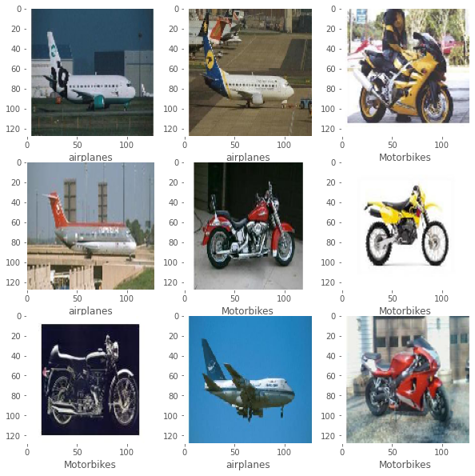

# Image Classification-Caltech101 dataset



The aim of the work is to build a image classifier to classify three objects. They are: 

1. airplane
2. motorbike
3. schooner

This work is completed using python as programming language. Libraries used are:

1. TensorFlow - Deep learning module which helps in building deep learning models
2. Matplotlib - Python module used for Visualizations
3. NumPy - Python module used to array transformations while building models

 To accomplish this work, we have used convolutional neural networks, otherwise referred as CNN’s. CNN is a deep learning algorithm mainly used for image inputs. Convolutional layers are the primary building blocks of a CNN. Convolution layer typically takes an image input (a matrix ) and do convolution operations with the kernel and forward the output matrix to next layer. Here, kernel is the learnable parameters which are learned over the training time. At each epoch, as the training images are fed, based on the loss these kernels are learnt during back propagation. Typically, a Convolutional Neural Network has three different types of layers. They are:

1. Convolutional Layer - Given an input, it performs the convolutional operations on input followed by activation function and passes the result as an output. Typically the activation function is RELU which stands for rectified linear units.
2. Pooling layer - pooling layers are used in network to decrease the dimensionality of the feature map. There are different types of pooling layers. Broadly, different pooling layers are MaxPooling, AvergaePooling, GlobalAveragepooling
3. Fully Connected Layer - After a series of convolution and max pooling layers, input is flattened out and sent to fully connected layers. In this type of layers, unlike CNN, every node is connected to every node in next layer.

For building a model, we are using TensorFlow module. It is an opensource module developed by google which eases the process of preparing data, building model and evaluation model. Classifier was programmed in colab using GPU provided by colab. 

Below are the steps involved in building image classifiers:

1. Splitting data
2. Building data pipelines
3. Data Visualization
4. Create Model
5. Train Model
6. Evaluate Model
7. Save Results

Four experimentations have been performed in the process of tuning the model.

### Splitting data.

Stratified splitting has been done on the whole dataset into train, test and validation in the ratio of 70,20 and 10 percentages respectively using a package called split-folders which is purely written in python. 

### Building data pipelines

Keras which is a part of TensorFlow provide an interface to load Image directory datasets into tensors. Below code demonstrates the process of loading dataset using keras data pipelines.

```python
#data pipeline
HEIGHT,WIDTH = 128,128
BATCH_SIZE = 32

datagen = tf.keras.preprocessing.image.ImageDataGenerator(
    rescale = 1/255.,
)

train_ds = datagen.flow_from_directory(
    './splits/train',
    target_size = (HEIGHT,WIDTH),
    class_mode='categorical',
    batch_size = BATCH_SIZE,
    shuffle = True,
)

val_ds = datagen.flow_from_directory(
    './splits/val',
    target_size = (HEIGHT,WIDTH),
    class_mode='categorical',
    batch_size = BATCH_SIZE,
    shuffle = True,
)
```

Batch size is set to 32 which indicates 32 images are fed into the network at once before weights are updated during backpropagation. Images are resized to decrease the load on GPU. Shuffling has been done on train and test to decrease the bias. 

### Data Visualization

Once the data pipelines are bult, randomly 10 images were drawn and visualized using the matplotlib library

```python
import random
random_list = random.sample(range(0, len(train_ds)), 10)
plt.figure(figsize=(10,10))
for i in range(9):
    plt.subplot(3,3,i+1)
    # plt.xticks([])
    # plt.yticks([])
    plt.grid(False)
    plt.imshow(train_ds[random_list[i]][0][0])
    #show label using label_map
    plt.xlabel(list(label_map.keys())[list(label_map.values()).index(np.argmax(train_ds[random_list[i]][1][0]))])
plt.show()
```

### Model Creation

This is the phase where experimentation/tuning of hyperparameters has to be done in-order to get best model. To start with, a basic model has been built with two series of convolution followed by maxpool layers and two dense layers with a sigmoid activation. Four different trails are performed to compare.

Trail -I:

```python
def create_model():
    model = tf.keras.Sequential([
        tf.keras.layers.Conv2D(32,3,activation='relu',input_shape=(HEIGHT,WIDTH,3)),
        tf.keras.layers.MaxPool2D(),
        tf.keras.layers.Conv2D(64,3,activation='relu'),
        tf.keras.layers.MaxPool2D(),
        tf.keras.layers.Flatten(),
        tf.keras.layers.Dense(512,activation='relu'),
        tf.keras.layers.Dense(3,activation='sigmoid'),
    ])
    return model
```

Below is the model summary of shapes and parameters


Keras and tensorflow provides an interface to define callbacks. Using callbacks, we can define what to happen at the end of each epoch. I have added two callbacks one to early stop and other to save best model at each epoch.

```python
def create_callbacks(metric = metric):
    base_path=Path('./outputs/Trail {}'.format(TRAIL_NO),'model')
    cpk_path = Path(base_path,'best_model.h5')
    checkpoint = tf.keras.callbacks.ModelCheckpoint(
        filepath=cpk_path,
        monitor= metric,
        mode='auto',
        save_best_only=True,
        verbose=1,
    )
    earlystop = tf.keras.callbacks.EarlyStopping(
        monitor= metric,
        mode='auto',
        patience=4, 
        verbose=1
    )
    callbacks=[checkpoint,earlystop]   
    return callbacks
```

Once callbacks are defined, model is compiled using Adam optimizer and Loss used is Categorical Cross Entropy. Tensorflow provides implementation of optimizer and loss. Now training is done.

```python
def compile_model(model, lr):
    optimizer = tf.keras.optimizers.Adam(learning_rate=lr)
    loss = tf.keras.losses.CategoricalCrossentropy()
    f1_score=tfa.metrics.F1Score(num_classes=3, threshold=0.5)
    model.compile(optimizer=optimizer, loss=loss,metrics=[tf.keras.metrics.CategoricalAccuracy(),f1_score])
    return model

tf.keras.backend.clear_session()
#calculate time
import datetime
start_time = datetime.datetime.now()
with tf.device('/device:GPU:0'):
    model=create_model()
    model = compile_model(model, lr=0.001)
    callbacks = create_callbacks() 
    history = model.fit(train_ds,
                        epochs=15,
                        callbacks=callbacks,
                        validation_data = val_ds,
                        verbose=1,
                       )
end_time = datetime.datetime.now()
training_times['Trail {}'.format(TRAIL_NO)] = end_time - start_time
```

```python
import matplotlib.pyplot as plt
from pathlib import Path
base_path=Path(f"./outputs/Trail {TRAIL_NO}","plots")
plotPaths=["loss_plot.png","accuracy plot.png","f1_score.png","lr_curve_plot.png","combined_plot.png"]
# construct a plot that plots and saves the training history
plt.style.use("ggplot")
#Loss Plot
plt.figure()
plt.plot(history.history["loss"], label="train_loss")
plt.plot(history.history["val_loss"], label="val_loss")
plt.title("Training Loss")
plt.xlabel("Epoch #")
plt.ylabel("Loss")
plt.legend(loc="best")
plt.savefig(Path(base_path,plotPaths[0]),dpi=300)
#Accuracy Plot
plt.figure()
plt.plot(history.history["categorical_accuracy"], label="train_accuracy")
plt.plot(history.history["val_categorical_accuracy"], label="val_accuracy")
plt.title("Training Accuracy")
plt.xlabel("Epoch #")
plt.ylabel("Accuracy")
plt.legend(loc="best")
plt.savefig(Path(base_path,plotPaths[1]),dpi=300)
```


Above are the training accuracy and training loss plots over 15 epochs.

### **Evaluate Model**

```python
#test dataset
test_datagen = tf.keras.preprocessing.image.ImageDataGenerator(rescale = 1/255.)
test_ds = test_datagen.flow_from_directory(
            'splits/test/',
            target_size = (HEIGHT,WIDTH),
            class_mode='categorical',
            batch_size = 1,
            shuffle=False,
        )
test_ds.reset()
model_path=Path(f"./outputs/Trail {TRAIL_NO}","model","best_model.h5")
model=tf.keras.models.load_model(Path(model_path))
with tf.device('/device:GPU:0'):
    pred=model.evaluate(test_ds,verbose=1)
    print("Model used is :",model_path.__str__())
    print(f"Test Loss: {pred[0]}")
    print(f"Test Accuracy: {pred[1]}")
    test_accuracies['Trail {}'.format(TRAIL_NO)]=pred[1]
    test_losses['Trail {}'.format(TRAIL_NO)]=pred[0]
```

Once training is completed, model is being evaluated using test dataset created in the beginning, Below are the metrics for test dataset.

**Test Loss: 0.07167135179042816
Test Accuracy: 0.9940476417541504**

**Confusion Matrix:**


Now, as trail -2 Another convolutional layer is added followed my maxpooling layer. Here is the summary of the model in Trail-2


Metrics on test Dataset for trail 2:

Test Loss: 0.09147582948207855
Test Accuracy: 0.9940476417541504

For trail 3, Another conv layer followed by max layer is added to existing model. Below is the model summary.


**Test Loss: 0.10367380827665329
Test Accuracy: 0.9940476417541504**

For Trail 4, data augmentation is done using keras data generator

```python
datagen = tf.keras.preprocessing.image.ImageDataGenerator(
    rescale = 1/255.,
    rotation_range=20,
    width_shift_range=0.2,
    height_shift_range=0.2,
    horizontal_flip=True,
    zoom_range = 0.2,
    shear_range = 0.2,
    vertical_flip = False,
)
```

Test Metrics:

**Test Loss: 0.1958087533712387
Test Accuracy: 0.9583333134651184**

Training Accuracy was 99% in all of the trails. Bar charts for test accuracies, test losses and training times are plotted for four trails as shown below

```python
#bar chart for test accuracies
import matplotlib.pyplot as plt
import numpy as np
plt.figure(figsize=(10,10))
plt.bar(test_accuracies.keys(),test_accuracies.values(),color='g')
plt.title("Test Accuracies")
plt.xlabel("Trail No")
plt.ylabel("Test Accuracy")
plt.savefig("test_accuracies.png",dpi=300)

#bar chart for test losses

plt.figure(figsize=(10,10))
plt.bar(test_losses.keys(),test_losses.values(),color='r')
plt.title("Test Losses")
plt.xlabel("Trail No")
plt.ylabel("Test Loss")
plt.savefig("test_losses.png",dpi=300)

#convert datetime to seconds
import datetime
for key in training_times:
    training_times[key]=training_times[key].total_seconds()

#bar chart for training times

plt.figure(figsize=(10,10))
plt.bar(training_times.keys(),training_times.values(),color='b')
plt.title("Training Times")
plt.xlabel("Trail No")
plt.ylabel("Training Time")
plt.savefig("training_times.png",dpi=300)
```


**Conclusion:**

Data Augmentation didn’t help in improving accuracy that much on test dataset and significantly more training time. Almost all trails have given decent test accuracies on the test dataset.

**References:**

1. [https://medium.com/@sidathasiri/building-a-convolutional-neural-network-for-image-classification-with-tensorflow-f1f2f56bd83b](https://medium.com/@sidathasiri/building-a-convolutional-neural-network-for-image-classification-with-tensorflow-f1f2f56bd83b)
2. [https://www.tensorflow.org/tutorials/images/classification](https://www.tensorflow.org/tutorials/images/classification)
3. [https://towardsdatascience.com/a-comprehensive-guide-to-convolutional-neural-networks-the-eli5-way-3bd2b1164a53](https://towardsdatascience.com/a-comprehensive-guide-to-convolutional-neural-networks-the-eli5-way-3bd2b1164a53)