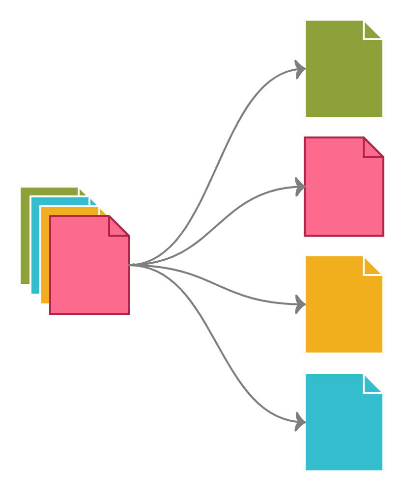

# Naïve Bayes Classifier for Text Classification

## Objective:

The main objective of this blog is to demonstrate and build a Naïve Bayes Classifier(NBC) on text data without  using any external modules i.e., to build from scratch. We are given Ford Sentence Classification Dataset[1] (Kaggle link —  [**Ford Sentence Classification**](https://www.kaggle.com/datasets/gaveshjain/ford-sentence-classifiaction-dataset)). This dataset consists corpus of text data related to 6 different categories. They are Responsibility, Requirement, Soft Skill, Experience, Skill and Education. By using Naïve Bayes Classifier, given a new sentence we are supposed to find out which type this sentence belongs to using bayes theorem. 

Let us see what exactly is a Naïve Bayes Classifier and how I built to predict the text without using any external modules.

## Introduction:

Natural Language processing is the ability of the computer to understand human languages and interpret them. Text Classification is one such application of NLP where the algorithm classifies the given text into a class based on words. In recent times, NLP has been one of the trendiest technology to learn. In this blog, we are going to build a text classifier using a very simple yet powerful algorithm called Naïve Bayes. Above mentioned dataset [1] has around 60k training samples and 15k test samples . The dataset is a part of the Ford Business Hiring Challenge. 

## What is Text Classification?

Text Classification is a machine learning technique where in develop a model which assigns the text a label to which it belongs to. One good example of text classification is sentimental analysis. In sentimental analysis, we are supposed to tag each text either a positive or negative. Text Classification has many applications in real life. Twitter uses sentimental analysis to flag inappropriate tweets using text classification techniques. Most of the real word text is in unstructured format. It takes a lot of efforts to clean and preprocess the text. 



## Naïve Bayes Classifier:

Naïve Bayes is an supervised learning algorithm which is based on the bayes theorem. Algorithm assumes features in the dataset are independent to each other. It is a simple yet powerful algorithm that can be used to text classification tasks. The algorithm can also be implemented without using any external libraries. To understand the Naïve Bayes theorem, we need to understand the concept of conditional probability. Bayes theorem in probability states that current probability of an event can be estimated using the past data related to that event. Bayes theorem is stated as follows:

Assume X is the data with features X1,X2,…..Xn. To calculate the probability that X belong to class Y, using bayes theorem, we use the below equation:


where 

P(Y | X1, X2, …, Xd) is the probability that given X data belongs to class Y. This is also called as ********************************************Posterior Probability******************************************** in statistics********************************************.********************************************

P(X1, X2, …, Xd | Y) P(Y) is the probability of occurring X when Y is true. This is also called as **********************Likelihood.**********************

P(Y) is the probability that Y occurs. This is also called as ****************Prior Probability.****************

P(X1, X2, …, Xd) is the probability that X occurs. This is also called as ******************************************Marginal Probability.******************************************

<aside>
💡 Naïve Bayes Classifier strictly assumes that all the features in the dataset are independent to each other

</aside>

## Implementation:

As the algorithm is easy to implement, no external modules are required to implement the algorithm. Below are the steps followed to implement this project.

******Step-1: Loading the data and pre-processing******

As the data is the CSV format, pandas is used to read the data frame. There are two csv files in the Kaggle namely train_data and test_data out of which test_data has no labels in it. Once data is loaded into the python environment, data frame is being split into train and test sets in the ratio of 80 and 30 respectively. The dataset has also null values in it. I have dropped all null values using pandas before splitting the dataset. 

```python
#load the data

import pandas as pd
df=pd.read_csv('train_data.csv',index_col=0)
df.head()

#drop Sentence_id
df.drop('Sentence_id',axis=1,inplace=True)

#check for null values
print(df.isnull().sum())

#drop null values

df.dropna(inplace=True)

print("Number of samples after dropping null values: ",df.shape[0])

#randomly select 20% of the data as test data

test=df.sample(frac=0.2)

#drop the test data from the train data

train_df=df.drop(test.index)

print("Number of samples in the train data: ",df.shape[0])
print("Number of samples in the test data: ",test.shape[0])
```

********************************************************************Step-2: Calculating Probabilities:********************************************************************

The core idea of Bayes theorem is to find Y that maximizes P(X1, X2, …, Xd|Y)*P(Y). So, we will build dictionaries for probability of Y and each word in each class.

We will start by calculating prior. Below code calculates and prints the prior to each class available in the dataset.

```python
# calculate class probabilities in the train data
prior=train_df['Type'].value_counts()/train_df.shape[0]
#convert into a dictionary
prior=prior.to_dict()
print(prior)
```

Now, we will build a nested dictionary to store conditional probabilities for each class. The dictionary is built in such a way that keys are classes and values are dictionaries with keys as words and values as count of that particular word in the class. Below is the code that demonstrates building dictionary. 

```python
def calculate_likelihoods(train_df,prior,alpha=0):
    likelihoods={}
    for c in prior.keys():
        likelihoods[c]={}
        for sentence in train_df[train_df['Type']==c]['New_Sentence']:
            # sentence=sentence.lower()
            # import re
            # words=set(re.findall(r'\w+',sentence))
            #remove stop words
            # from nltk.corpus import stopwords
            # stop_words=set(stopwords.words('english'))
            # words=[word for word in words if word not in stop_words]
            for word in set(sentence.split()):
                #add the word to the dictionary with count 1 if it is not present
                #else increment the count by 1
                likelihoods[c][word]=likelihoods[c].get(word,0)+1
    #remove the words with count less than 3
    for c in likelihoods.keys():
        likelihoods[c]={k:v for k,v in likelihoods[c].items() if v>=3}
    #convert the counts into probabilities
    for c in likelihoods.keys():
        total_count=sum(likelihoods[c].values())
        # print("Total number of words in class ",c," is ",total_count)
        for word in likelihoods[c].keys():
            #add alpha to the count to avoid zero probabilities
            likelihoods[c][word]=(likelihoods[c][word]+alpha)/(total_count+alpha*len(likelihoods[c].keys()))
    return likelihoods
```

Once dictionary is built, Likelihood of all words is also calculated which is probability of that word occurring given a class type.

```python
likelihoods=calculate_likelihoods(train_df,prior,alpha=0)
```

Above function calculate_likelihods takes three parameters namely train_df, prior and alpha. Here alpha is the smoothening parameter which we will learn more about in the coming sections.

As now we had likelihoods and priors, it’s time to predict the sentence which type it belongs to using past data. Below is the function that predicts the type of a class given a sentence and optionally alpha.

```python
def predict(sentence,alpha=0):
    #split the sentence into words
    words=sentence.split()
    #initialize the class probabilities
    class_probabilities={}
    #iterate over all the classes
    for c in prior.keys():
        #initialize the class probability with the prior probability of the class
        class_probabilities[c]=prior[c]
        #iterate over all the words in the sentence
        for word in words:
            #if the word is present in the class, multiply the class probability
            #with the conditional probability of the word given the class
            if word in likelihoods[c].keys():
                class_probabilities[c]*=likelihoods[c][word]
            else:
                #multiply with zero
                class_probabilities[c]*=alpha/(sum(likelihoods[c].values())+alpha*len(likelihoods[c].keys()))
    #return the class with the maximum probability
    return max(class_probabilities,key=class_probabilities.get)
```

Now, it’s time to predict. Let us run predict function on every sentence in the test dataset using apply function in pandas library. Once predictions are done, accuracy is calculated and printed.

```python
#predict the class of the test data
test['Predicted']=test['New_Sentence'].apply(predict)

#calculate the accuracy

accuracy=(test['Type']==test['Predicted']).sum()/test.shape[0]

print("Accuracy of the model is: ",accuracy)
```

The Accuracy of the Naïve Bayes Classifier without smoothening has given an accuracy of **54.3%.**

## Experiments:

Once the pipeline is built, following experiments were done. 

1. Compared the effect of Laplace smoothing.
    
    Laplace smoothing is a smoothing technique which handles zero error in calculating probabilities. Consider a case, where you need to classify the text into a class but the word does not exists in likelihood table. Some of the basic approaches is to return either zero or ignore the term. But these could be decremental in nature. So, to avoid these problems, smoothing is done while calculating the probabilities. 
    
    
    
    Above is the formula to apply Laplace smoothing. where
    
    alpha is the smoothing parameter
    
    K is the number of features available in the dataset.
    
    I have experimented with alpha values 0,1,5,10,50,100 and 1000. From my experimentation, it is found out that the best alpha value is 1. Beyond 1, as the alpha value increases accuracy is decreasing. Below is the plot that demonstrates accuracy vs alpha on test dataset.
    
    
    
2. Derived top 10 words that predicts each class
    
    Using likelihoods, I have derived top 10 words for each class. Below are the code and results to used to derive.
    
    ```python
    for cls in likelihoods.keys():
        print("Top 10 words in class ",cls," are: ")
        words=[word[0] for word in sorted(likelihoods[cls].items(),key=lambda x:x[1],reverse=True)[:10]]
    ```
    
    
    
3. Effect of data cleaning using NLP techniques like regextokenizer, stopwords removal.
    
    I have tried applying techniques like stop words removal, transforming all words to lower case and filtering tokens using regular expressions. Code to implement this are commented out in various sections above.
    

## My Contributions:

Below are list of my contributions for building an text classifier using Naïve Bayes algorithm.

1. I have followed blogs [2] , [3] and [4] to understand the naïve bayes and Laplace smoothing.
2. Learnt bayes theorem and how to implement NBC from scratch without usage of any external libraries.
3. Deep dived into conditional probability concepts
4. Encountered some challenges while implementing NBC without any modules but by thorough understanding of concepts, I could able to solve them again.
5. Understood the applications of text classification in real life scenarios.
6. Have experimented with various alpha values in finding the best smoothing factor
7. Learnt how to preprocess text data using various inbuilt functions and external modules in python.

## Challenges Encountered and Resolutions:

While solving the project, I encountered few challenges. Below are challenges and how I resolved them.

1. The biggest challenge I encountered is to formulate the algorithm without any libraries efficiently.
    
    To resolve this, I have experimented various ways and analyzed how much each implementation is taken. I have used nested dictionaries to efficiently store the data. I could also reduce lines of code by using python functions like get in dictionaries.
    
2. I also found it little difficult to understand NBC algorithm. 
    
    By going through lecture notes and some online blogs, I could get a clear understanding of the algorithm easily which eventually helped me in solving this project.
    

## References:

[1] [https://www.kaggle.com/datasets/gaveshjain/ford-sentence-classifiaction-datase](https://www.kaggle.com/datasets/gaveshjain/ford-sentence-classifiaction-dataset)t

[2] [https://www.analyticsvidhya.com/blog/2022/03/building-naive-bayes-classifier-from-scratch-to-perform-sentiment-analysis/](https://www.analyticsvidhya.com/blog/2022/03/building-naive-bayes-classifier-from-scratch-to-perform-sentiment-analysis/)

[3] [https://towardsdatascience.com/laplace-smoothing-in-naïve-bayes-algorithm-9c237a8bdece](https://towardsdatascience.com/laplace-smoothing-in-na%C3%AFve-bayes-algorithm-9c237a8bdece)

[4] [https://medium.com/@rangavamsi5/naïve-bayes-algorithm-implementation-from-scratch-in-python-7b2cc39268b9](https://medium.com/@rangavamsi5/na%C3%AFve-bayes-algorithm-implementation-from-scratch-in-python-7b2cc39268b9)

[**Log output:**](files/Log%20output%20dabd8128644249809851863160df1a97.md)