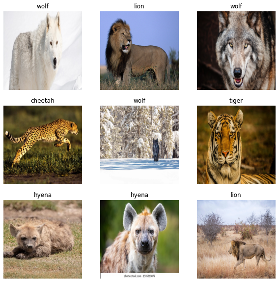

# Image Classification-Wild Animal Dataset



sample of 10 images randomly taken from the dataset

### Objective

The objective of this project is to build a robust classifier to identify 6 different animals given a picture. List of animals we are going to classify are 

1. Cheetah
2. Fox
3. Hyena
4. Lion
5. tiger
6. Wolf

By the end of this blog, we will be able to build a image classifier with 98% accuracy. In this blog, we will deep dive into various steps involved in building an image classifier. We will compare different machine learning and deep learning algorithms against the test dataset. Without further ado, let us deep dive into the steps to follow in building image classifier. 

### Introduction

Computer Vision is an area of Artificial Intelligence where we use computers to derive meaningful information from visual elements like images, videos and other forms of media. Image Classification is one such use case where the goal is given an input image, classify it into one of the classes. This is one of the wide-spread application in computer vision. This can be achieved by using machine learning and deep learning algorithms which are discussed in detail in further sections. In this blog, we will such an image classifier from scratch as well as using some pretrained models to detect animals in the image.

In this blog, we will use python as a programming language. Following are the external libraries that must be installed before moving into further sections.

1. Pandas (to store experimentation results in the csv format)
2. Matplotlib ( to visualize outputs)
3. Seaborn ( Another advanced visualization library built on top of Matplotlib)
4. Scikit-learn ( Large Machine learning library for Python)
5. OpenCV ( Real time Optimized Computer Vision Library)
6. NumPy ( library to handle large multi-dimensional arrays and matrices operations)
7. TensorFlow ( End-To-End Library for Machine Learning and Artificial Intelligence)

Now, let us go through various steps involved in building a classifier. In this blog, we will implement various machine learning algorithms including K Nearest neighbors Classifier, Support Vector Classifier, Random Forest Classifier, Logistic Regression, Decision Tree Classifier, Gaussian Naïve Bayes Classifier and Convolutional Neural Networks

### Steps Summary

1. Import required modules
2. Loading the dataset
3. Splitting the data
4. Data preprocessing
5. Model Training

**************************************************1. Import required modules**************************************************

Let us start building the model by importing all the required modules in the beginning. 

```python
#import necessary libraries
from pathlib import Path
import warnings
import re
import random
import pandas as pd
import matplotlib.pyplot as plt
import matplotlib.image as mpimg
import tensorflow as tf
from sklearn.naive_bayes import GaussianNB
from sklearn.tree import DecisionTreeClassifier
from sklearn.linear_model import LogisticRegression
from sklearn.ensemble import RandomForestClassifier
from sklearn.svm import SVC
from sklearn.neighbors import KNeighborsClassifier
from sklearn.metrics import accuracy_score
from sklearn.model_selection import train_test_split
from sklearn.preprocessing import LabelEncoder
import seaborn as sns
import cv2
import time
import os
import numpy as np
%matplotlib inline
warnings.filterwarnings('ignore')
```

********2.Loading the Data********

The dataset is Wild Animals Dataset. It can be downloaded from Kaggle by clicking [here](https://www.kaggle.com/datasets/whenamancodes/wild-animals-images). The dataset contains wild animal images of 6 different species as mentioned in objectives. Each animal has been provided in three different sizes ( 224,300,512) and stored in different folders. The directory structure is as shown below..


We will start by loading animal images of 512 x 512 size. While building a image classifier, Image Size is one of the hyper parameter which affects model accuracy. Let us define some variables before loading the dataset which will ease the experimentation at later stages.

```python
#variables to easily perform iterations
image_size_to_load=128
image_size_to_train=(512,512)
#we will store all the results in each iteration in a 
results={}
training_times={}

vis_path='visualizations/{}'.format(image_size_to_train[0])
Path(vis_path).mkdir(parents=True, exist_ok=True)
```

We will now find out how many images are there in all of the subfolders of image size 512.

There are 1724 images in total for 6 classes. Let us now create labels. While reading the images, we will store all the image paths and the parent folder name of each image as we can use them as labels while training the model. Once image paths and labels are stored in arrays, we will regular expressions to clean the labels. 

```python
dataset_path="wild_animals_images"
image_paths=[]
labels=[]
for path in Path(dataset_path).glob(r'**/*.png'):
    if str(image_size_to_load) in str(path.parent.name):
        image_paths.append(path)
        labels.append(path.parent.parent.name)
print("Number of images found:", len(image_paths))

#remove -resize-\d\d\d from labels list 
labels = [re.sub(r'-resize-\d\d\d', '', label) for label in labels]

unique_labels = set(labels)
print("Number of unique labels:", len(unique_labels))
print("Unique labels:", unique_labels)
number_of_classes=len(unique_labels)
```

As the labels are of string type and algorithm only understand numbers, we will perform label encoding and convert them into integers.  We will also store label mapping we used to encode labels for further decoding the integer labels

```python
#convert labels to numbers using LabelEncoder
le = LabelEncoder()
le.fit(labels)
labels = le.transform(labels)

#get labels names
labels_to_names = dict(zip(le.transform(le.classes_), le.classes_))
print("Labels to names:", labels_to_names)
```

3.************************************Splitting the data************************************

Now, as we have all the image paths and class name of each image path, we will split the whole dataset into two partitions namely training set and testing set. We will split the dataset in the ratio of 80:20 respectively. Once the model is trained using the training data, we will use test dataset to evaluate the model. 

```python
#now split the data into train and test sets in the ratio of 80:20
X_train, X_test, y_train, y_test = train_test_split(image_paths, labels, test_size=0.2, random_state=42)
```

****************************************4.Data Preprocessing****************************************

Now, we will load the training and testing images into memory for model training. Below is the function, given image paths and labels, it reads the list of images and resizes to a given shape and return NumPy matrices.

```python
#now we will create a function to load the images and resize them to 224x224

def process_images(paths,labels,resize=(128,128),flatten=True,verbose=True):
    X=[]
    y=[]
    for i,path in enumerate(paths):
        if verbose and i%100==0:
            print("Processing image number:",i)
        try:
            img=cv2.imread(str(path))
            img=cv2.cvtColor(img,cv2.COLOR_BGR2RGB)
            img=cv2.resize(img,resize)
            X.append(img)
            y.append(labels[i])
        except:
            print("Error processing image:",path)
    X=np.array(X)
    if flatten:
        X=X.reshape(X.shape[0],-1)
    return X,y

#now we will load the train and test images
print("Loading Training Images into memory")
X_train,y_train=process_images(X_train,y_train,resize=image_size_to_train,flatten=True,verbose=False)
print("Loading Test Images into memory")
X_test,y_test=process_images(X_test,y_test,resize=image_size_to_train,flatten=True,verbose=False)
```

While loading the dataset, it is observed that 3-4 images in whole dataset are corrupted. I have used exceptions to handle them and ignore the dataset.

Before starting to train the models, let us randomly pick 9 images from the training dataset and print them to see if every step was performed correctly or not. Every time, you run below snippet, you will get new set of images as images are sampled randomly

```python
#visualize the resized images again
fig = plt.figure(figsize=(10,10))
for i in range(9):
    ax = fig.add_subplot(3,3,i+1)
    random_index = random.randint(0, len(X_train))
    img = X_train[random_index].reshape(image_size_to_train[0],image_size_to_train[1],3)
    ax.imshow(img)
    ax.set_title(labels_to_names[y_train[random_index]])
    ax.axis('off')
```


********************************5.Model Building********************************

Let us jump into building multiple image classifiers and find the best classifier. 

1. ******************************K Nearest Neighbors Classifier******************************
    
     KNN Classifier is a simple and lazy machine learning algorithm. Given number of neighbors k, the algorithm tries to classify the new data point to one of the neighbors based on the distance metric like Euclidean Distance. The algorithm is implemented in Scikit-learn. Below is the code snippet to train and test the algorithm.
    
    
    
    ```python
    #now we will use the KNN classifier to classify the images
    knn=KNeighborsClassifier(n_neighbors=5)
    start_time=time.time()
    knn.fit(X_train,y_train)
    end_time=time.time()
    training_times['KNN']=end_time-start_time
    y_pred=knn.predict(X_test)
    results['KNN']=accuracy_score(y_test,y_pred)
    print("Accuracy:",results['KNN'])
    ```
    

1. **Support Vector Machine Classifier**
    
    SVM’s are supervised machine learning algorithms where in classification happens by drawing decision boundaries.
    
    
    
    ```python
    svm=SVC()
    start_time=time.time()
    svm.fit(X_train,y_train)
    end_time=time.time()
    training_times['SVM']=end_time-start_time
    y_pred=svm.predict(X_test)
    results['SVM']=accuracy_score(y_test,y_pred)
    print("Accuracy:",results['SVM'])
    ```
    
2. ******************Random Forest Classifier******************
    
    Random Forest Classifier is also another supervised machine learning algorithm where it is a ensemble of many decision trees. Here, all the decision trees are used as parallel estimators. It is more better than a single decision tree classifier. 
    
    
    
    ```python
    #now we will use the Random Forest classifier to classify the images
    rf=RandomForestClassifier()
    start_time=time.time()
    rf.fit(X_train,y_train)
    end_time=time.time()
    training_times['Random Forest']=end_time-start_time
    y_pred=rf.predict(X_test)
    results['Random Forest']=accuracy_score(y_test,y_pred)
    print("Accuracy:",results['Random Forest'])
    ```
    
3. **Logistic Regression Classifier**
    
    Logistic regression classifier is mainly used for binary tasks but can also extended to multi class problems as well. Here, we will use logistic function otherwise known as sigmoid function to classify the inputs.
    
    
    
    ```python
    #now we will use the Logistic Regression classifier to classify the images
    lr=LogisticRegression(max_iter=1000)
    start_time=time.time()
    lr.fit(X_train,y_train)
    end_time=time.time()
    training_times['Logistic Regression']=end_time-start_time
    y_pred=lr.predict(X_test)
    results['Logistic Regression']=accuracy_score(y_test,y_pred)
    print("Accuracy:",results['Logistic Regression'])
    ```
    
4. **Decision Tree Classifier**
    
    Decision tree is another supervised machine learning algorithm where questions are asked iteratively and based on that, classification is done. Below is a visual representation of the decision tree.
    
    
    
    ```python
    #now we will use the Decision Tree classifier to classify the images
    dt=DecisionTreeClassifier()
    start_time=time.time()
    dt.fit(X_train,y_train)
    end_time=time.time()
    training_times['Decision Tree']=end_time-start_time
    y_pred=dt.predict(X_test)
    results['Decision Tree']=accuracy_score(y_test,y_pred)
    print("Accuracy:",results['Decision Tree'])
    ```
    
5. **Naïve Bayes Classifier**
    
    Naïve Bayes is an supervised learning algorithm which is based on the bayes theorem. Algorithm assumes features in the dataset are independent to each other. To understand the Naïve Bayes theorem, we need to understand the concept of conditional probability. Bayes theorem in probability states that current probability of an event can be estimated using the past data related to that event. Bayes theorem is stated as follows:
    
    Assume X is the data with features X1,X2,…..Xn. To calculate the probability that X belong to class Y, using bayes theorem, we use the below equation:
    
    
    
    where 
    
    P(Y | X1, X2, …, Xd) is the probability that given X data belongs to class Y. This is also called as ********************************************Posterior Probability******************************************** in statistics********************************************.********************************************
    
    P(X1, X2, …, Xd | Y) P(Y) is the probability of occurring X when Y is true. This is also called as **********************Likelihood.**********************
    
    P(Y) is the probability that Y occurs. This is also called as ****************Prior Probability.****************
    
    P(X1, X2, …, Xd) is the probability that X occurs. This is also called as ******************************************Marginal Probability.******************************************
    
    <aside>
    💡 Naïve Bayes Classifier strictly assumes that all the features in the dataset are independent to each other
    
    </aside>
    
    ```python
    #now we will use the Naive Bayes classifier to classify the images
    nb=GaussianNB()
    start_time=time.time()
    nb.fit(X_train,y_train)
    end_time=time.time()
    training_times['Naive Bayes']=end_time-start_time
    y_pred=nb.predict(X_test)
    results['Naive Bayes']=accuracy_score(y_test,y_pred)
    print("Accuracy:",results['Naive Bayes'])
    ```
    
6. **Convolutional Neural Networks**
    
    Convolutional neural networks, otherwise referred as CNN’s. CNN is a deep learning algorithm mainly used for image inputs. Convolutional layers are the primary building blocks of a CNN. Convolution layer typically takes an image input (a matrix ) and do convolution operations with the kernel and forward the output matrix to next layer. Here, kernel is the learnable parameters which are learned over the training time. At each epoch, as the training images are fed, based on the loss these kernels are learnt during back propagation. 
    
    
    
    In this blog, we will build two variants using CNN’s. One is named as vanilla CNN where we build a network using series of convolutional layers and max pooling layers. Another model is we inherit Efficient Net V2 architecture proposed by google. More can be studied from [here](https://arxiv.org/abs/2104.00298).
    
    We will also create some callbacks using TensorFlow callbacks API to save model, reduce learning rate when accuracy is not changing over epochs and aslo to perform early stopping. Below is the code to create above mentioned callbacks.
    
    ```python
    metric = "val_categorical_accuracy"
    def create_callbacks(metric = metric,filename="base_model.h5",patience=5):
        Path("models").mkdir(parents=True, exist_ok=True)
        cpk_path="models/"+filename
        checkpoint = tf.keras.callbacks.ModelCheckpoint(
            filepath=cpk_path,
            monitor= metric,
            mode='auto',
            save_best_only=True,
            verbose=1,
        )
        earlystop = tf.keras.callbacks.EarlyStopping(
            monitor= metric,
            mode='auto',
            patience=patience, 
            verbose=1
        )
        reduce_lr = tf.keras.callbacks.ReduceLROnPlateau(
            monitor= metric,
            mode='auto',
            patience=patience//2,
            verbose=1,
            factor=0.5
        )
        callbacks=[checkpoint,earlystop,reduce_lr]
        return callbacks
    ```
    
    Now, we’ll create both Vanilla CNN and Efficient Net architectures using TensorFlow API’s. Efficinet Net was implemented in TensorFlow library and instead of random initialization of the weights, I have initialized with pretrained image net weights. 
    
    ```python
    # #build the model
    def create_base_model(number_of_classes,image_size_to_train):
        model = tf.keras.Sequential([
            tf.keras.layers.Conv2D(32,3,activation='relu',input_shape=(image_size_to_train[0],image_size_to_train[1],3)),
            tf.keras.layers.MaxPool2D(),
            tf.keras.layers.Conv2D(64,3,activation='relu'),
            tf.keras.layers.MaxPool2D(),
            tf.keras.layers.Conv2D(128,3,activation='relu'),
            tf.keras.layers.MaxPool2D(),
            tf.keras.layers.Conv2D(256,3,activation='relu'),
            tf.keras.layers.MaxPool2D(),
            tf.keras.layers.Flatten(),
            tf.keras.layers.Dense(512,activation='relu'),
            tf.keras.layers.Dense(number_of_classes,activation='sigmoid'),
        ])
        return model
    
    def create_effnv2_model(number_of_classes,image_size_to_train):
        pretrained = tf.keras.applications.efficientnet_v2.EfficientNetV2B0(include_top=False,weights='imagenet',input_shape=[*image_size_to_train,3])
        x = pretrained.output
        x = tf.keras.layers.GlobalAveragePooling2D()(x)
        x = tf.keras.layers.Dense(512, activation = tf.keras.layers.LeakyReLU(alpha=0.2))(x)
        x=tf.keras.layers.BatchNormalization()(x)
        x = tf.keras.layers.Dense(128, activation = tf.keras.layers.LeakyReLU(alpha=0.2))(x)
        outputs = tf.keras.layers.Dense(number_of_classes,activation="sigmoid", dtype='float32')(x)
        model = tf.keras.Model(pretrained.input, outputs)
        return model
    ```
    
    Once the model is build, we will compile the model using Adam optimizer and Categorical Cross Entropy loss. We will train both the models for 100 epochs. Early Stopping callback will stop training if accuracy hasn’t improved for 5 continuous epochs. 
    
    ```python
    def compile_model(model, lr):
        optimizer = tf.keras.optimizers.Adam(learning_rate=lr)
        loss = tf.keras.losses.CategoricalCrossentropy()
        model.compile(optimizer=optimizer, loss=loss,metrics='categorical_accuracy')
        return model
    ```
    
    ```python
    tf.keras.backend.clear_session()
    with tf.device('/device:GPU:1'):
        base_model=create_base_model(number_of_classes,image_size_to_train)
        base_model=compile_model(base_model,lr=0.0001)
        callbacks=create_callbacks(metric=metric,filename="base_model.h5",patience=5)
        start_time=time.time()
        base_history=base_model.fit(X_train,y_train,epochs=100,validation_data=(X_test,y_test),callbacks=callbacks,batch_size=1)
        end_time=time.time()
        training_times['Vanilla_CNN']=end_time-start_time
    ```
    
    ```python
    #train the model using efficientnetv2
    
    tf.keras.backend.clear_session()
    with tf.device('/device:GPU:0'):
        effn_model=create_effnv2_model(number_of_classes,image_size_to_train)
        effn_model = compile_model(effn_model, lr=0.001)
        callbacks = create_callbacks(filename="effnv2_model.h5")
        start_time=time.time() 
        effn_history = effn_model.fit(X_train,y_train,epochs=100,validation_data=(X_test,y_test),callbacks=callbacks,batch_size=8)
        end_time=time.time()
        training_times['EfficientNetV2']=end_time-start_time
    ```
    

### Experimentation & Results:

All of the above models are trained and tested against two image sizes. They are 128 x 128 and 256 x256.  Let us compare all the models against accuracy and training times taken.

Below are the accuracies and training times of all models with the input image have been resized to 128 x 128.  Efficient net Outperformed all other models still maintaining less training time.


Above are the training and testing accuracies of both vanilla CNN and Efficient Net models. We can observe the models has noticeable overfitting. Overfitting is a problem where the model performs very well on training data but fails to generalize. As a result testing accuracy will be very less. The gap between training and testing accuracy tells how overfit the models are. Now, let us see the results with 256 x 256 image inputs.


Accuracies of both CNN models for 256  image size are as follows:


As seen above, Efficient Net could generalize the model eliminating the problem of overfitting. It has given 98.5% accuracy on the test dataset which is significant higher than all other models experimented with.

Below are the results in tabular format for better interpretation.


### Conclusion

There is significant increase in accuracy by using Convolutional layers rather than Machine Learning algorithms for Image Classification tasks. CNN’s are proven to work better for image inputs. Architectures like EFficcientNetV2 helped in achieving the state of the art accuracy. Consolidated results of accuracies and training times are as shown below.


### Challenges:

Below are the challenges that I faced and how I solved them. 

1. While loading images into memory, I have noticed some of the images in the dataset are corrupted. Using Exceptional handling, I made sure, I have removed them while training and testing.
2. As the dataset is huge, I have made use of GPU to train CNN networks for faster speeds. I went through online tutorials on how to make use of GPU for faster traning.
3. I have also faced some errors stating resource exhausted while training CNN’s. I have reduced batch size inorder to train the models. Using StackOverflow, I have also made some changes to GPU environment to make efficient use of GPU.

### References

1. [https://arxiv.org/pdf/2104.00298.pdf](https://arxiv.org/pdf/2104.00298.pdf)
2. [https://towardsdatascience.com/11-most-common-machine-learning-algorithms-explained-in-a-nutshell-cc6e98df93be](https://towardsdatascience.com/11-most-common-machine-learning-algorithms-explained-in-a-nutshell-cc6e98df93be)
3. [https://www.kaggle.com/datasets/whenamancodes/wild-animals-images](https://www.kaggle.com/datasets/whenamancodes/wild-animals-images)
4. [https://www.tensorflow.org/api_docs/python/tf](https://www.tensorflow.org/api_docs/python/tf)
5. [https://scikit-learn.org/0.21/documentation.html](https://scikit-learn.org/0.21/documentation.html)
6. [https://seaborn.pydata.org/tutorial.html](https://seaborn.pydata.org/tutorial.html)